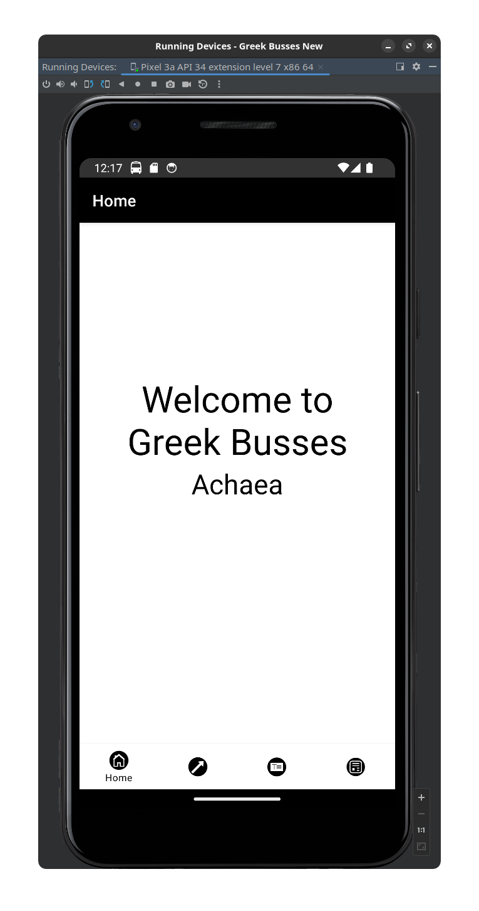
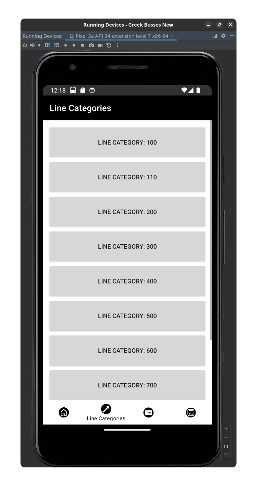
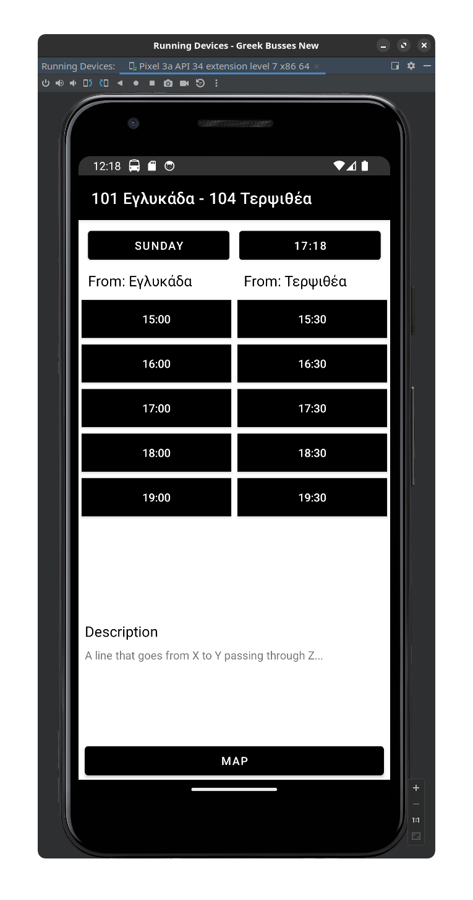

# Greek Busses

A (unfinished) application for checking bus routes, time, descriptions, etc

## Description

This application is made using Android Studio using Java, Firebase Database for storing images and line information and google maps. The point of the application is to check bus routes and times from your android phone. The application is unfinished because there is no available up-to-date data about busses in my city, so I just used placeholder automatically generated data from a Java class (for each line on each day I added routes from 9AM to 9PM, on saturdays and sundays 10AM to 8PM.

## Screenshots

